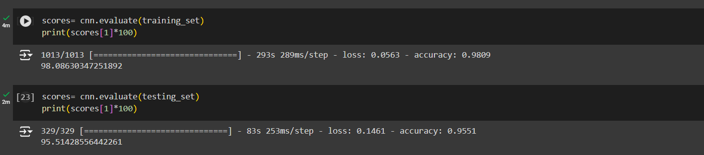
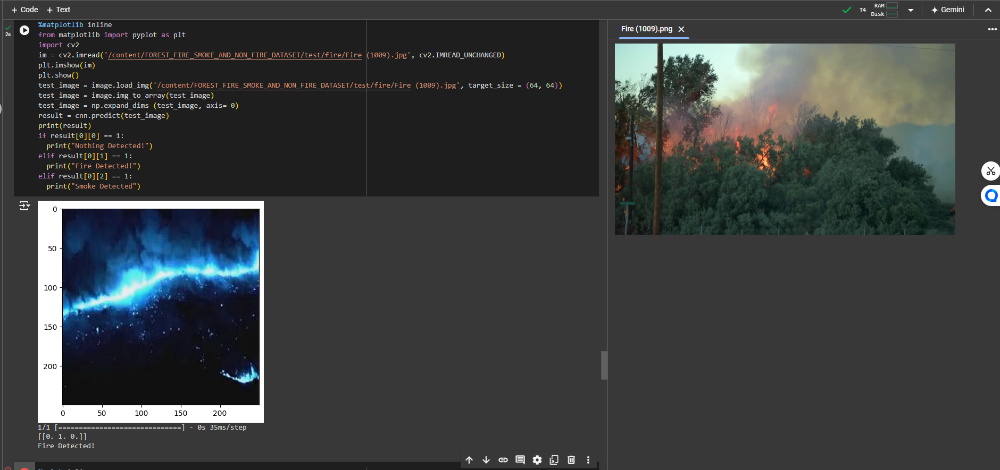
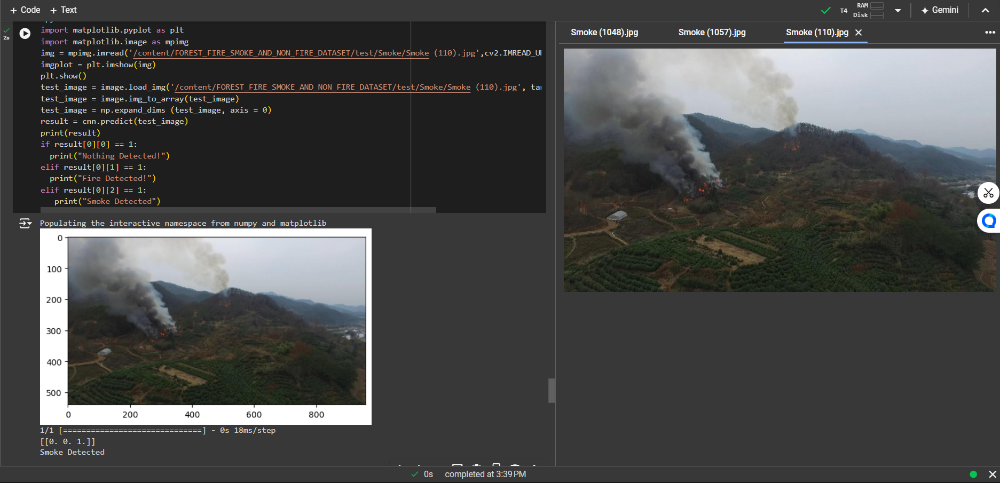

# Forest Fire and Smoke Detection

This project aims to detect forest fires and smoke in images using a Convolutional Neural Network (CNN) implemented with TensorFlow and Keras. The dataset contains images categorized as fire, smoke, and non-fire.

## Table of Contents


- [Introduction](#introduction)
- [Dataset](#dataset)

- [Setup](#setup)
- [Data Preprocessing](#data-preprocessing)
- [Model Architecture](#model-architecture)
- [Training the Model](#training-the-model)
- [Evaluating the Model](#evaluating-the-model)
- [Making Predictions](#making-predictions)
- [Saving and Loading the Model](#saving-and-loading-the-model)
- [Conclusion](#conclusion)
- [Future Work](#future-work)


## Introduction

Forest fires pose a significant threat to the environment, wildlife, and human lives. Early detection of fires and smoke is crucial for mitigating their impact. This project utilizes deep learning techniques to classify images into three categories: fire, smoke, and non-fire.

## Dataset 

The dataset is downloaded from Kaggle and consists of images categorized into three classes:

* Fire
* Smoke
* Non-Fire
 
### [Dataset Link](https://www.kaggle.com/datasets/amerzishminha/forest-fire-smoke-and-non-fire-image-dataset)

#### It consists of :-

 - ***32398*** - Training images belonging to 3 classes.
 - ***10500*** - Testing images belonging to 3 classes.

## Setup

### Install Dependencies

To get started with this project, clone the repository and install the necessary dependencies:

```
git clone https://github.com/ABHINAV2087/Forest-Fire-and-Smoke-Detection.git
cd forest-fire-smoke-detection
```

The following libraries are required to run the project:

- TensorFlow
- Keras
- Kaggle API
- OpenCV
- Matplotlib
- Scikit-learn
- NumPy
- PIL (Python Imaging Library)

You can install the required libraries using the following command:

```python
pip install tensorflow keras kaggle opencv-python matplotlib scikit-learn numpy pillow
```


## Kaggle API

To download the dataset from Kaggle, you need to set up the Kaggle API. Follow these steps:

1. Install the Kaggle API:

```python
pip install kaggle
```

2. Place your **kaggle.json** file in the *~/.kaggle/* directory:

```python
!mkdir -p ~/.kaggle
!cp kaggle.json ~/.kaggle/
!chmod 600 ~/.kaggle/kaggle.json
```
3. After downloading, extract the dataset:

```python
from zipfile import ZipFile

datasets = 'forest-fire-smoke-and-non-fire-image-dataset.zip'

with ZipFile(datasets, 'r') as zip:
    zip.extractall()
    print('The dataset is extracted')
```

## Data Preprocessing


To prepare the image data for training and testing the Convolutional Neural Network (CNN) model, we use the ImageDataGenerator class from Keras.<br>

This class allows us to augment our images in real-time while the model is being trained, which helps improve the model's generalization ability.<br>

The images are rescaled, and data augmentation techniques such as shear, zoom, and horizontal flip are applied.
```python
from keras.preprocessing.image import ImageDataGenerator

training_data_gen = ImageDataGenerator(
    rescale=1./255,
    shear_range=0.2,
    zoom_range=0.2,
    horizontal_flip=True
)

training_set = training_data_gen.flow_from_directory(
    '/content/FOREST_FIRE_SMOKE_AND_NON_FIRE_DATASET/train',
    target_size=(64, 64),
    batch_size=32,
    class_mode='categorical'
)

testing_datagen = ImageDataGenerator(rescale=1./255, horizontal_flip=True)
testing_set = testing_datagen.flow_from_directory(
    '/content/FOREST_FIRE_SMOKE_AND_NON_FIRE_DATASET/test',
    target_size=(64, 64),
    batch_size=32,
    class_mode='categorical'
)
```


## Model Architecture
A Convolutional Neural Network (CNN) is built using TensorFlow and Keras with the following architecture:

- Convolutional layers with ReLU activation
- Max Pooling layers
- Flatten layer
- Fully connected (Dense) layers
- Output layer with Softmax activation


```python
import tensorflow as tf

cnn = tf.keras.models.Sequential()
cnn.add(tf.keras.layers.Conv2D(filters=16, kernel_size=3, activation='relu', input_shape=[64, 64, 3]))
cnn.add(tf.keras.layers.Conv2D(filters=16, kernel_size=3, activation='relu'))
cnn.add(tf.keras.layers.MaxPool2D(pool_size=3, strides=2))
cnn.add(tf.keras.layers.Conv2D(filters=16, kernel_size=3, activation='relu'))
cnn.add(tf.keras.layers.Conv2D(filters=16, kernel_size=3, activation='relu'))
cnn.add(tf.keras.layers.MaxPool2D(pool_size=3, strides=2))
cnn.add(tf.keras.layers.Flatten())
cnn.add(tf.keras.layers.Dense(units=100, activation='relu'))
cnn.add(tf.keras.layers.Dense(units=100, activation='relu'))
cnn.add(tf.keras.layers.Dense(units=3, activation='softmax'))
```


## Training the Model

The model is compiled with the Adam optimizer and categorical cross-entropy loss function. It is trained for ***25 epochs*** with the training and testing sets.

```python
cnn.compile(optimizer='adam', loss='categorical_crossentropy', metrics=['accuracy'])

cnn.fit(x=training_set, validation_data=testing_set, epochs=25)

cnn.summary()

```

## Evaluating the Model

The model's accuracy is evaluated on both the training and testing sets.

```python
scores = cnn.evaluate(training_set)
print(f'Training Accuracy: {scores[1] * 100}%')

scores = cnn.evaluate(testing_set)
print(f'Testing Accuracy: {scores[1] * 100}%')
```
###  Evaluation stats :




## Confusion Matrix

A confusion matrix is plotted to visualize the model's performance on the test set.

```python 
from sklearn.metrics import confusion_matrix
import matplotlib.pyplot as plt
import itertools
import numpy as np

cm = confusion_matrix(testing_set[0][1].argmax(axis=1), rounded_predictions.argmax(axis=1))

def plot_confusion_matrix(cm, classes, normalize=False, title='Confusion matrix', cmap=plt.cm.Blues):
    plt.imshow(cm, interpolation='nearest', cmap=cmap)
    plt.title(title)
    plt.colorbar()
    tick_marks = np.arange(len(classes))
    plt.xticks(tick_marks, classes, rotation=45)
    plt.yticks(tick_marks, classes)

    if normalize:
        cm = cm.astype('float') / cm.sum(axis=1)[:, np.newaxis]
        print("Normalized confusion matrix")
    else:
        print('Confusion matrix, without normalization')

    print(cm)

    thresh = cm.max() / 2.
    for i, j in itertools.product(range(cm.shape[0]), range(cm.shape[1])):
        plt.text(j, i, cm[i, j], horizontalalignment='center', color='white' if cm[i, j] > thresh else 'black')
    plt.tight_layout()
    plt.ylabel('True label')
    plt.xlabel('Predicted label')

cm_plot_labels = ['default', 'fire', 'smoke']
plot_confusion_matrix(cm, cm_plot_labels, title='Confusion Matrix')

```


 
## Making Predictions

The model is used to predict new images from the test set.

```python
from keras.preprocessing import image
import numpy as np
import matplotlib.pyplot as plt
import cv2

def predict_image(img_path):
    im = cv2.imread(img_path, cv2.IMREAD_UNCHANGED)
    plt.imshow(im)
    plt.show()
    test_image = image.load_img(img_path, target_size=(64, 64))
    test_image = image.img_to_array(test_image)
    test_image = np.expand_dims(test_image, axis=0)
    result = cnn.predict(test_image)
    if result[0][0] == 1:
        print("Nothing Detected!")
    elif result[0][1] == 1:
        print("Fire Detected!")
    elif result[0][2] == 1:
        print("Smoke Detected")

predict_image('/content/FOREST_FIRE_SMOKE_AND_NON_FIRE_DATASET/test/non fire/NF_1180.jpg')
predict_image('/content/data/data/img_data/test/default/img_114.jpg')

```
### Prediction on testing fire image : 


### Prediction on testing smoke image : 


## Saving and Loading the Model

The trained model is saved and can be reloaded for future use.

```python
cnn.save('fire_smoke_detection_model.h5')

from keras.models import load_model
new_model = load_model('fire_smoke_detection_model.h5')

```

## Conclusion

This project demonstrates the application of a ***Convolutional Neural Network (CNN)*** for detecting forest fires and smoke in images. The model can effectively classify images into fire, smoke, and non-fire categories.

## Future Work
 
 Possible future improvements include:

- Increasing the dataset size for better generalization.
- Experimenting with different CNN architectures and hyperparameters.
- Implementing real-time fire and smoke detection using video streams.
